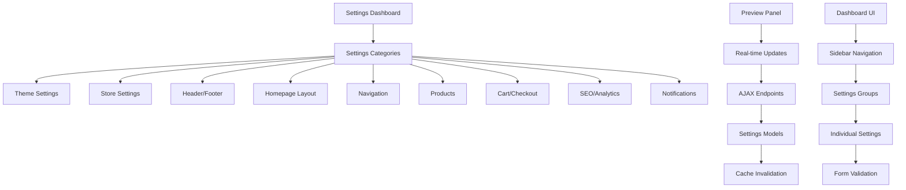

# Store Settings Dashboard - Enterprise Edition

## Project Overview

This document outlines the implementation plan for a comprehensive store settings dashboard with real-time preview functionality. The dashboard will manage all aspects of e-commerce store customization, following a modern, responsive design with side-by-side settings and preview panels.

## Architecture Overview

### Current Structure

- **Models**: 20+ settings models organized into separate files
- **Utilities**: Comprehensive storefront and dashboard analytics utilities
- **Public API**: Well-defined API for accessing settings from views, templates, and middleware
- **Signals**: Auto-initialization for new tenants

### Target Architecture



## Dashboard Features

### Core Functionality

1. **Side-by-Side Layout**: Settings panel on left, preview on right
2. **Real-Time Preview**: AJAX updates to show changes instantly
3. **Responsive Design**: Works on desktop, tablet, and mobile
4. **Settings Categories**: Organized into logical groups
5. **Bulk Actions**: Apply theme presets and templates
6. **Version Control**: Save and restore settings snapshots
7. **Search & Filter**: Quickly find settings
8. **Keyboard Shortcuts**: Enhance productivity
9. **Help Documentation**: Context-sensitive help for each setting
10. **Analytics**: Track settings changes and performance impact

### Settings Categories

| Category                  | Description                                   | Models                                             |
| ------------------------- | --------------------------------------------- | -------------------------------------------------- |
| **Store Identity**        | Store name, contact info, branding            | StoreSettings                                      |
| **Theme & Design**        | Colors, fonts, spacing, styles                | ThemeSettings, CustomCSS                           |
| **Header & Navigation**   | Header layout, menu settings, search          | HeaderSettings, NavigationMenu, NavigationMenuItem |
| **Footer**                | Footer content, social links, payment methods | FooterSettings, SocialMediaLinks                   |
| **Homepage**              | Sections, banner slides, layout               | HomepageLayout, BannerSlide                        |
| **Products**              | Display settings, page layouts                | ProductDisplaySettings, ProductPageSettings        |
| **Cart & Checkout**       | Cart behavior, checkout flow                  | CartSettings, CheckoutSettings                     |
| **Search**                | Search configuration and behavior             | SearchSettings                                     |
| **Email & Notifications** | Transactional email templates, notifications  | EmailTemplateSettings, NotificationSettings        |
| **Blog**                  | Blog settings and layout                      | BlogSettings                                       |
| **Mobile App**            | PWA and mobile app settings                   | MobileAppSettings                                  |
| **Popups**                | Promotion and marketing popups                | PopupSettings                                      |
| **Performance**           | Caching, optimization, CDN settings           | PerformanceSettings                                |
| **Advanced**              | Custom CSS, theme presets                     | CustomCSS, ThemePreset                             |

## Views & URL Structure

### Main Dashboard Views

```
/store-settings/
├── / (dashboard home)
├── /theme/ (theme settings with preview)
├── /store/ (store identity)
├── /header/ (header settings)
├── /footer/ (footer settings)
├── /homepage/ (homepage layout)
├── /banner-slides/ (CRUD for banner slides)
├── /navigation/ (menu management)
├── /products/ (product display settings)
├── /cart/ (cart settings)
├── /checkout/ (checkout settings)
├── /search/ (search settings)
├── /email/ (email templates)
├── /notifications/ (notification settings)
├── /blog/ (blog settings)
├── /mobile/ (mobile app settings)
├── /popups/ (popup settings)
├── /performance/ (performance settings)
├── /custom-css/ (CSS management)
├── /theme-presets/ (theme templates)
└── /advanced/ (advanced settings)
```

### AJAX Endpoints

```
/api/store-settings/
├── /preview/ (render preview HTML)
├── /validate/ (validate form fields)
├── /apply-preset/ (apply theme preset)
├── /reset/ (reset to defaults)
└── /cache/ (invalidate cache)
```

## UI/UX Design

### Design Principles

1. **Consistency**: Uniform design across all settings categories
2. **Clarity**: Clear labels and descriptions for each setting
3. **Efficiency**: Quick access to frequently used settings
4. **Responsiveness**: Adapts to different screen sizes
5. **Feedback**: Real-time updates and confirmation messages
6. **Accessibility**: WCAG 2.0 AA compliant

### Layout Structure

```
┌─────────────────────────────────────────┐
│ Dashboard Header with Search            │
├──────────────┬──────────────────────────┤
│              │                          │
│  Sidebar     │  Main Content            │
│  Navigation  │  ┌──────────────────────┐
│              │  │ Settings Panel       │
│  - Theme     │  │ (Form Fields)        │
│  - Store     │  └──────────────────────┘
│  - Header    │                          │
│  - Footer    │  ┌──────────────────────┐
│  - Homepage  │  │ Preview Panel        │
│  - Products  │  │ (Live Preview)       │
│              │  └──────────────────────┘
│              │                          │
└──────────────┴──────────────────────────┘
```

### Design Components

1. **Typography**: Clear hierarchy using Inter font
2. **Colors**: Professional palette with blue primary colors
3. **Buttons**: Consistent styling with hover effects
4. **Forms**: Clean input fields with validation feedback
5. **Cards**: Well-defined sections with subtle shadows
6. **Animations**: Smooth transitions and hover effects
7. **Icons**: Consistent icon style for all actions

## Implementation Plan

### Phase 1 - Foundation (1-2 days)

1. Create base template structure
2. Implement sidebar navigation
3. Create dashboard home page with overview
4. Set up URL routing
5. Implement form base classes

### Phase 2 - Core Settings (2-3 days)

1. Theme settings with preview
2. Store settings with basic info
3. Header and footer settings
4. Homepage layout management
5. Banner slide CRUD operations

### Phase 3 - Advanced Settings (2-3 days)

1. Product display settings
2. Cart and checkout settings
3. Search configuration
4. Email template settings
5. Notification settings

### Phase 4 - Advanced Features (3-4 days)

1. Navigation management with tree view
2. Custom CSS editor
3. Theme presets and templates
4. Performance optimization settings
5. Mobile app and PWA settings

### Phase 5 - Preview & Polish (2-3 days)

1. Real-time preview functionality
2. AJAX form validation
3. Responsive design improvements
4. Accessibility features
5. Performance optimization

### Phase 6 - Testing & Documentation (1-2 days)

1. Unit and integration tests
2. User acceptance testing
3. Documentation creation
4. Performance profiling
5. Bug fixes

## Technical Stack

### Frontend

- **Framework**: Django Templates with Jinja2
- **Styling**: Tailwind CSS with custom utilities
- **JavaScript**: Vanilla JavaScript with Fetch API
- **Icons**: Font Awesome 6.0
- **Animations**: CSS transitions and transforms

### Backend

- **Framework**: Django 4.x
- **ORM**: Django ORM with PostgreSQL
- **Multi-tenant**: django-tenants
- **Caching**: Redis
- **Task Queue**: Celery (for async operations)

### Development

- **Testing**: pytest with coverage
- **Documentation**: Sphinx
- **CI/CD**: GitHub Actions
- **Code Quality**: flake8, black, isort

## Performance Optimizations

### Database

- Index frequently queried fields
- Use select_related and prefetch_related
- Implement database caching

### Caching

- Redis for settings cache
- Template fragment caching
- CDN for static assets

### Frontend

- Minify CSS and JavaScript
- Optimize images
- Lazy loading for media

## Security Considerations

### Authentication

- Role-based access control (RBAC)
- Two-factor authentication (2FA)
- Session management

### Authorization

- Permissions per settings category
- Audit logging for changes
- API rate limiting

### Data Protection

- Encryption at rest
- Input validation
- XSS and CSRF protection

## Future Enhancements

### Version 2.0

1. A/B testing for settings
2. Settings comparison tool
3. Scheduled settings changes
4. Settings import/export
5. Advanced analytics

### Version 3.0

1. Machine learning recommendations
2. Predictive performance optimization
3. AI-powered design suggestions
4. Advanced theme customization
5. API integrations

## Conclusion

This comprehensive store settings dashboard will provide enterprise-grade customization capabilities for multi-tenant e-commerce platforms. The side-by-side preview functionality will enhance the user experience, allowing merchants to see the impact of their changes instantly. The architecture is designed for scalability, performance, and maintainability, ensuring the dashboard can grow with the needs of the business.
